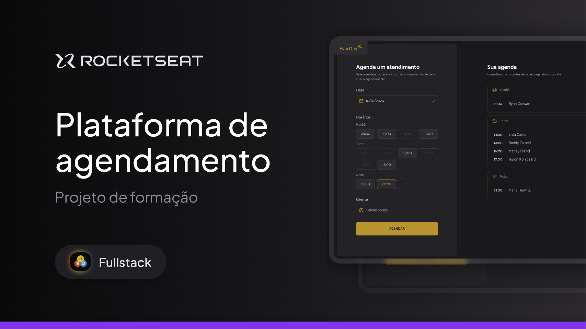

# ✂️ HairDay - Agendamento de Barbearia

O **HairDay** é uma plataforma de agendamento simplificada projetada para barbearias modernas. O objetivo é substituir as agendas de papel por um sistema digital intuitivo, onde o barbeiro pode visualizar sua carga de trabalho diária organizada por períodos e evitar o temido conflito de horários.

## 📸 Preview

## 💎 Diferenciais da Aplicação

### ⏳ Linha do Tempo Dinâmica
Diferente de agendas comuns, o HairDay separa os atendimentos em **Manhã**, **Tarde** e **Noite**. Isso facilita a organização dos profissionais e a gestão de turnos dentro da barbearia.

### 🛡️ Sistema Anti-Conflito
O sistema valida cada tentativa de agendamento em tempo real. Se um cliente tentar agendar um corte para as 15h e já houver um compromisso marcado, o sistema bloqueia a ação, garantindo a pontualidade do serviço.

### ⚡ Experiência Single Page (SPA)
- **Sem Refresh:** Graças à integração reativa, novos agendamentos e cancelamentos aparecem na tela instantaneamente.
- **Persistência de Dados:** Todos os agendamentos são salvos em um banco de dados via API REST (JSON Server), garantindo que a informação não se perca.

## 🎨 Interface e Estilo
Focada no público das barbearias clássicas e modernas:
- **Design Limpo:** Informações diretas ao ponto.
- **Acessibilidade:** Botões de cancelamento fáceis de identificar e formulários validados.

## 🛠️ Stack Técnica
- **Core:** JavaScript (ES6+), HTML5 e CSS3.
- **Datas e Horários:** [DayJS](https://day.js.org/) para manipulação de horários e filtros de agenda.
- **Comunicação:** Fetch API para integração com banco de dados local.
- **Servidor:** JSON Server para simulação de backend.

## 👤 Autor

- **Jouberth Alves Macedo** - Desenvolvedor Principal
---
Desenvolvido para manter o estilo e a produtividade em dia. 💈